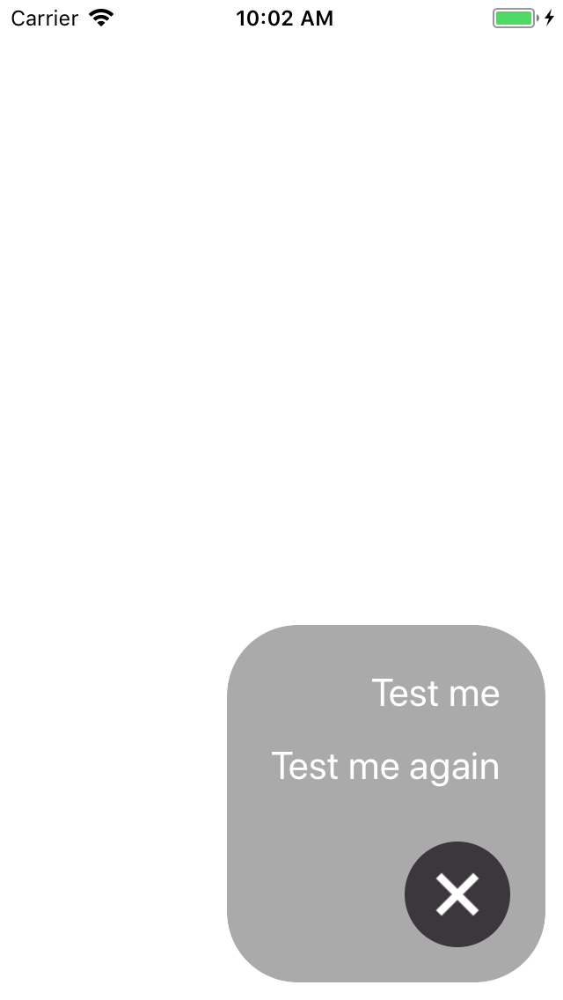

# react-native-plus-button-box
A component to display an Android-like "+" button and display action items

# Properties

Property Name | Type
--- | ---
actions | arrayOf(<br>  { <br>         key: string,<br>         onPress: function,<br>         text?: string<br>     } <br> )
boxColor | string
buttonColor | string
underlayColor | string

# Usage

```js
import CallToActionBox from 'react-native-plus-button-box';

class MyComp extends Component {
    render() {
        return (
            <CallToActionBox
                actions={[
                    {
                        key: 'test',
                        text: 'Test me',
                        onPress: () => Alert.alert('Hello')
                    },
                    {
                        key: 'test2',
                        text: 'Test me again',
                        onPress: () => Alert.alert('Hello to you too')
                    }
                ]}
            />
        );
    }
}
```

# Result


Closed | Open
--- | ---
 | 
